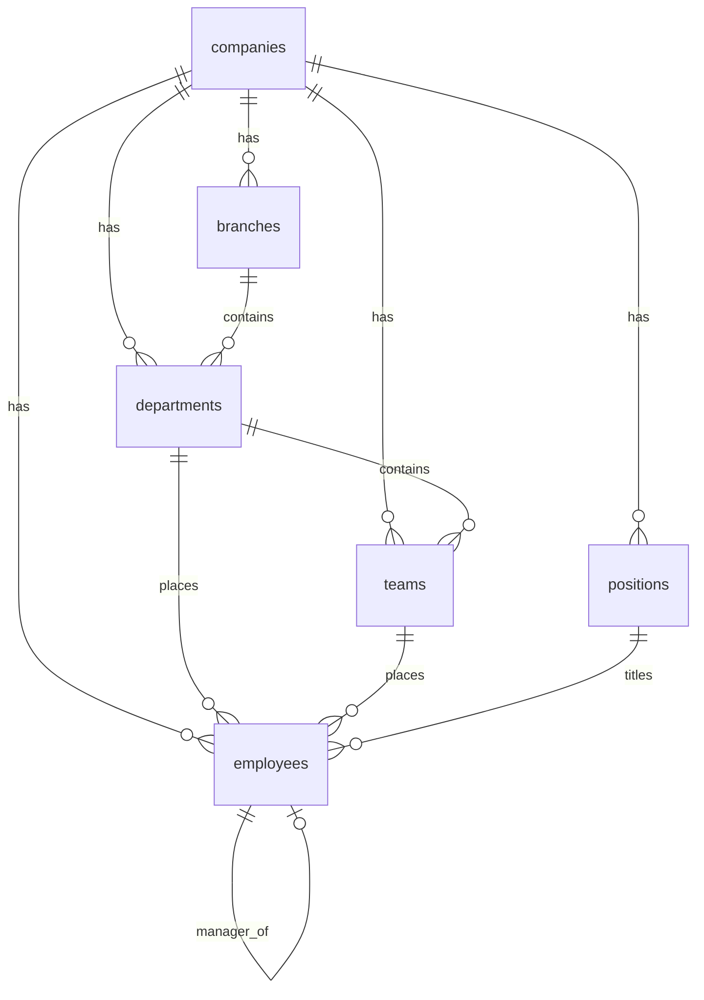
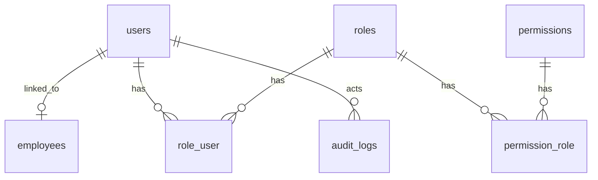
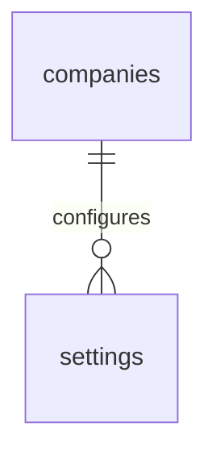
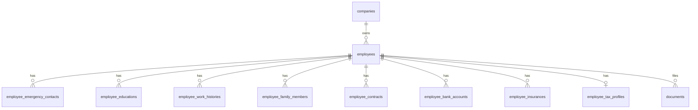
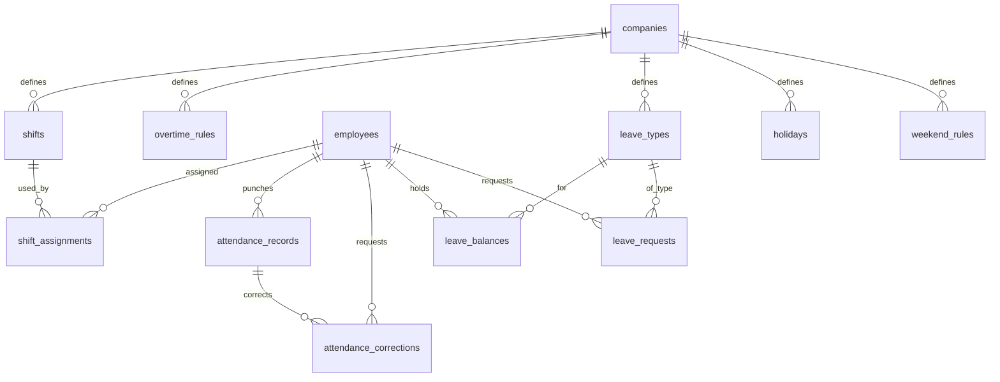
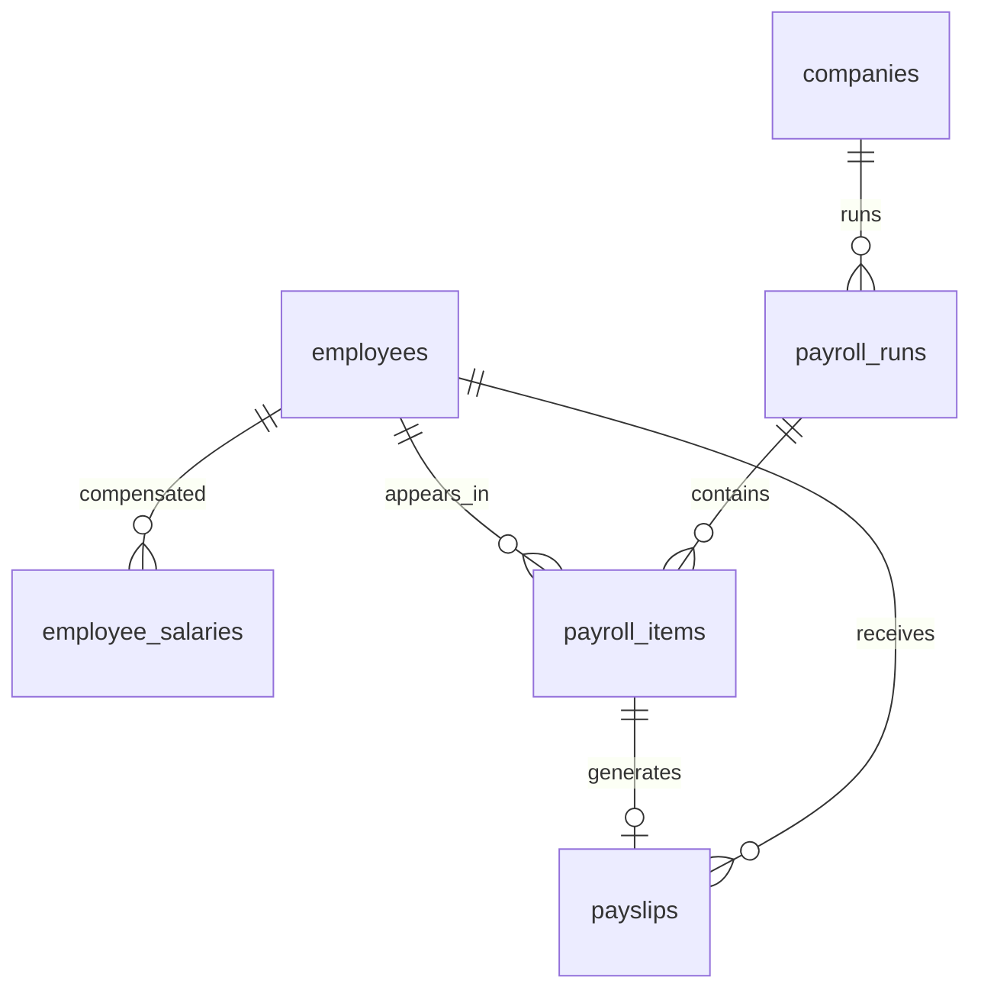
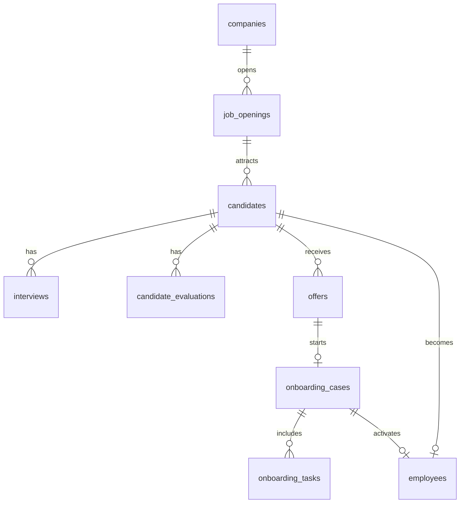
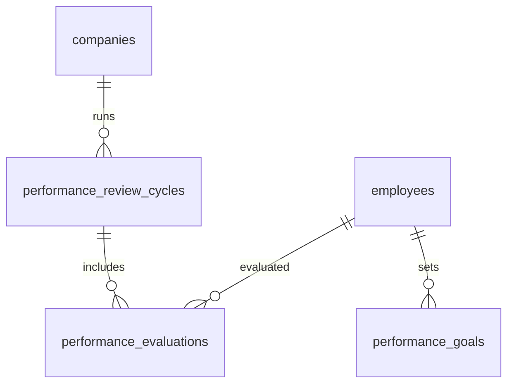
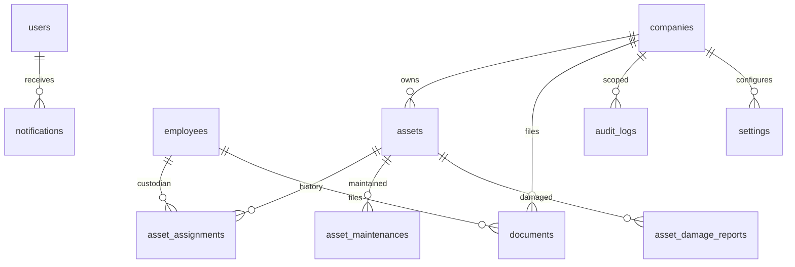

# ERD

> Logical entity-relationship overview for the HRM platform.
>
> This is a **logical ERD** for documentation and design alignment — not a generated dump of every column.
>
> Naming: [DATABASE_NAMING.md](./DATABASE_NAMING.md) · Relationships: [TABLE_RELATIONSHIP.md](./TABLE_RELATIONSHIP.md)

---

## How to Read

- Boxes are entities/tables (logical).
- Arrows show FK direction: `child → parent` means child holds the FK.
- Phased delivery creates subsets of this model over time.
- Satellite employee tables are summarized where helpful.

---

## 1. Organization Spine

Notes:

- Exact parentage (branch vs department required) is a product rule; schema should allow company-scoped hierarchy.
- Manager / supervisor / HR owner may be self-FKs or separate relation fields on `employees`.

---

## 2. Auth & Authorization

---

## 2b. Settings (company-scoped)

Logical model (implementation may use one row-per-key or JSON groups):

| Field (logical) | Meaning |
|-----------------|---------|
| `company_id` | Tenant scope (required for business settings) |
| `group` | Namespace: `company`, `auth`, `attendance`, … |
| `key` | Stable setting key within group |
| `value` | Typed JSON / string value |
| timestamps | `created_at` / `updated_at` |

Rules:

- Unique on `(company_id, group, key)` (or equivalent).
- Secrets (SMTP passwords, API keys) stay in env/secret manager — not in `settings`.
- API surface: [SETTINGS_API.md](../06-api/SETTINGS_API.md).

Global/system-only keys (rare) may use `company_id` null only if explicitly documented; prefer company-scoped defaults for SaaS readiness.

---

## 3. Employee Cluster

---

## 4. Time Domain (Shift · Attendance · Leave)

Payroll reads attendance summaries via services; it does not own punch tables.

---

## 5. Payroll

Allowances, bonuses, deductions attach to employees and/or payroll items as implemented — keep ownership inside Payroll.

---

## 6. Hire Path (Recruitment → Onboarding → Employee)

Candidates are not employees until hire/onboarding activation policy says so.

---

## 7. Performance

---

## 8. Assets · Documents · Notifications · Audit · Settings

Settings detail: §2b above. Audit writes are append-only from domain services/listeners ([AUDIT_API.md](../06-api/AUDIT_API.md) is read-only).

---

## Cross-Cutting Identity

Stable identity hubs used across modules:

| Entity | Referenced by |
|--------|----------------|
| `companies` | Almost all business tables, including `settings` |
| `users` | Auth, notifications, audit actors, role assignments |
| `employees` | Attendance, leave, shift, payroll, assets, performance, documents |
| `settings` | Modules read via Settings service (not ad-hoc env for business rules) |

---

## Explicit Non-Edges (dependency safety)

Do **not** model these ownership edges:

| Forbidden ownership | Why |
|---------------------|-----|
| `attendance_records` → `payslips` as child ownership | Payroll consumes attendance; does not invert ownership |
| `reports_*` as parent of domain writes | Reports are read-oriented |
| `notifications` owning leave/payroll rows | Notifications carry references only |

---

## Related Documents

- [TABLE_RELATIONSHIP.md](./TABLE_RELATIONSHIP.md)
- [DATABASE_NAMING.md](./DATABASE_NAMING.md)
- [../01-architecture/DATABASE_ARCHITECTURE.md](../01-architecture/DATABASE_ARCHITECTURE.md)
- [../02-business/README.md](../02-business/README.md)
